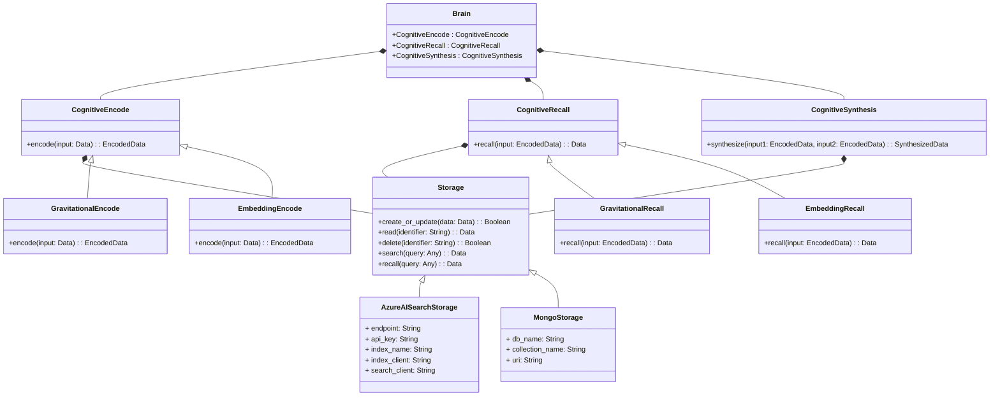

| Environment | Version |
| ----------- | ------- |
| Production  | 0.0.1   |
| Development | 0.0.1   |

# 🦉 Cognitive Space

The **cognitive-space** package offers tools for abstracting and storing Recall Space Cognitive Algorithms💫. It allows you to customize different components of the 🧠AI brain abstraction to suit your application's requirements, ranging from basic vector search to advanced engram modeling.

+ *note:* Requires **recall-space-benchmark**, **agent-builder** packages.

## ✨ Key Features

1. Build your Recall Space AI Brain using the composite design pattern.
2. Run the recall-space-benchmark on your agents with AI Brain.
3. Develop innovative models of the AI Brain that can be easily integrated into the Recall Space ecosystem.

## 🏢 UML Class Design

### ✖️➕ Recall Space algorithms
+ **Embedding Model:** It is the simplest `EmbeddingEncode: CognitiveEncode` and `EmbeddingRecall: CognitiveRecall` algorithms that we provide, and it's perfect for simple cases. Visit [README](/cognitive_space/algorithms/embedding_model/README.md)
+ **Gravitational Model**: This model is inspired by classical gravitational theory. `GravitationalEncode: CognitiveEncode` optimizes the potential gravitational energy of the memory planetary system, where point masses are replaced by vector embeddings. `GravitationalRecall: CognitiveRecall` employs gradient descent to collapse an incoming memory into the strongest gravitational field of the existing memories. Visit [README](/cognitive_space/algorithms/gravitational_model/README.md)

+ **Engram Model**: soon.

### 💾 Recall Space Storages
+ **AzureAISearchStorage:** Used Azure AI search client to serve as interface to azure vector indexes. Visit [README](/cognitive_space/storage/azure_ai_search/README.md)
+ **MongoStorage:** Used mongo client to serve as interface to key value pair storage. Visit [README](/cognitive_space/storage/mongo/README.md)

### 🧠 Suggested AI Brain configurations.
+  [Embedding Based Brain](/cognitive_space/brain/README.md)
+  [Gravity Based Brain](/cognitive_space/brain/README.md)

#### 🧪🗺️Benchmark *Embedding Based Brain*

+ Visit [colors notebook](/cognitive_space/benchmarks_docs/embedding_model/colors.md) -> 4/4
+ Visit [jokes notebook](/cognitive_space/benchmarks_docs/embedding_model/jokes.md) -> 2/4

#### 🧪🌐Benchmark *Gravity Based Brain*

+ Visit [colors notebook](/cognitive_space/benchmarks_docs/gravitational_model/colors.md) -> 3/4
+ Visit [jokes notebook](/cognitive_space/benchmarks_docs/gravitational_model/jokes.md) -> 1/4