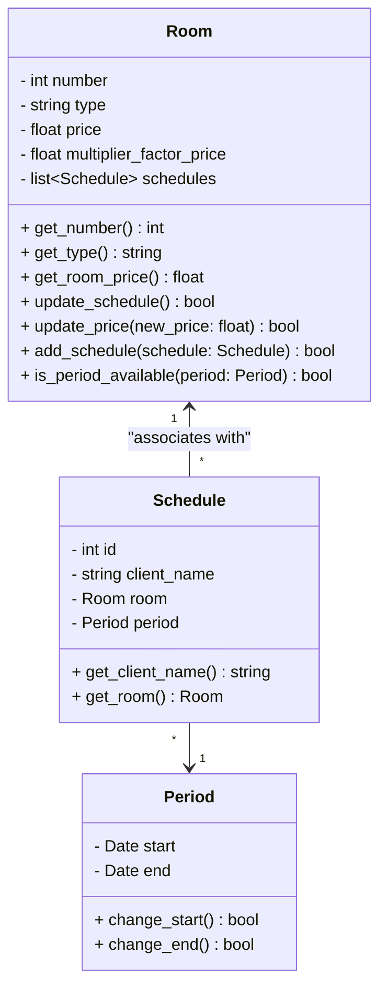

# Seminar of Software Engineer
Basic project that implement tests with [Pytest](https://docs.pytest.org/en/stable/) and poetry dependence manager into a hotel reservation system.

## Team
- Pedro Luis
- Arthur Bueno
- Pedro Augusto
- Marcos Henrique

## Requirements
- Chrome extension to view mermaid diagrams: [Mermaid Previewer](https://chromewebstore.google.com/detail/mermaid-previewer/oidjnlhbegipkcklbdfnbkikplpghfdl?utm_source=ext_app_menu)
- Python 3.12

## Architecture


## Code Quality


### Linter
The project uses [flake8](https://flake8.pycqa.org/en/latest/) as linter. To run the linter in all code, execute the following command:
```bash
flake8 .
```
If the linter find a problem, it will show a message with the error.
```bash
./src/Schedule.py:13:3: E303 too many blank lines (2)
./src/Schedule.py:20:1: W391 blank line at end of file
```
Fixing the error manually and when finish, flake8 will not show any message.

### Formatter
The project uses [black](https://black.readthedocs.io/en/stable/) as formatter. To run the formatter in all code, execute the following command:
```bash
black .
```

### Sorting Imports
The project uses [isort](https://pycqa.github.io/isort/) as sorting imports. To run the sorting imports in all code, execute the following command:
```bash
isort .
```

### Resume
- **Black**: A code formatter that applies consistent style across your code automatically.
- **isort**: Organizes and sorts imports to keep them clean and PEP 8-compliant.
- **Flake8**: A linter that checks for syntax errors, potential bugs, and style violations.

### Documentation

- **GitHub Pages**: https://pedroluisdionisiofraga.github.io/poetry-and-pytest-usage/

### Release

- **PyPi**: https://pypi.org/project/hazbin-hotel/