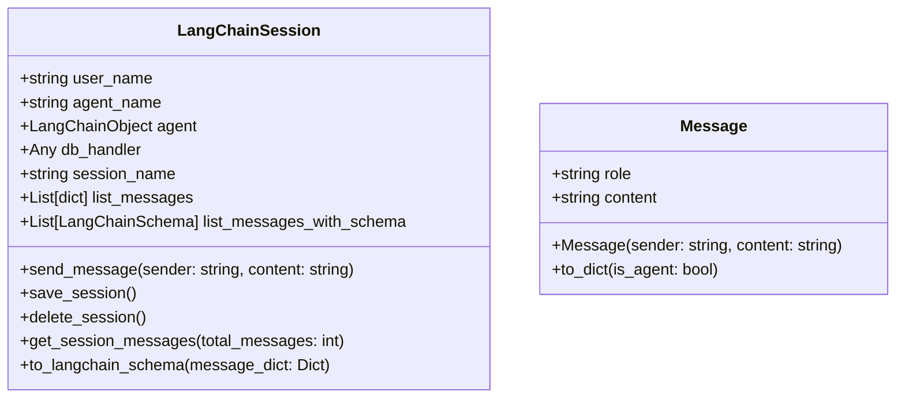

[](https://recall.space/)

[](https://www.python.org/)
[](https://github.com/psf/black)

| Environment | Version |
| ----------- | ------- |
| Production  | 0.0.1   |
| Development | 0.0.1   |


# 🧠Recall Space Benchmark

The **Recall Space Benchmark** is carefully designed to test the ability of LLM based application to retain state "remember" from past interactions.


# 💬LangChainSession

+ Use the `LangChainSession` as a wrapper around any LangChain object that implements the `invoke` method. LangChainSession is a class that stores the state of the conversation.



## LangChainSession with Azure Open AI (No backend).

+ It's beneficial to experiment with a stateful chat with a Langchain object.
+ The state is not persisted in this configuration.

```python
from benchmark.session_interface.langchain_session import LangChainSession
from langchain_openai import AzureChatOpenAI

user_name = "Developer G"
llm = AzureChatOpenAI(
        base_url=os.getenv("AZURE_GPT4O_BASE_URL"),
        api_key=os.getenv("AZURE_GPT4O_KEY"),
        api_version=os.getenv("AZURE_GPT4O_API_VERSION"),
        streaming=False,
    )
llm_name = "gpt-4o"

session = LangChainSession(
    user_name=user_name, 
    agent_name=llm,
    agent=llm_name,
    db_handler=None,
    session_name="Test of Developer and Azure Open AI gpt-4o")

# The langchain object should reply -> Hello, how may I help you.
session.send_message(sender=user_name, content="hi again!")
session.send_message(sender=user_name, content="What is the capital of Germany?")
```

# 💫Recall Space
+ To request early access to the AI Brain, please email `info@recall.space`.
+ Don't worry; you can still use this package even if you do not have access to Recall Space products, just make
sure not to activate brain features e.g. `ai_brain_flag=True`.

## LangChainSession with Recall Space AI Brain Powered agent.
+ Here we used MongoDB to persist the state of the chat session.
+ We also used the AI Brain service from Recall Space. 

```python
from benchmark.utils.mongo_connector import MongoConnector
import os
# Currently, the only connector that is available is Mongo.
# To run a local instance of mongo, you could use docker
# docker 
#   run -d --name mongodb-container -p 27017:27017 -v ~/mongo-data:/data/db mongo

mongo_connector = MongoConnector(
    db_name="playground",
    collection_name="sessions_and_chats",
    uri="mongodb://localhost:27017")
```

+ Create a LangChainSession with a Recall Space AI Brain powered agent.


```python
from benchmark.session_interface.langchain_session import LangChainSession
from benchmark.utils.recall_space.recall_space_agent import agent_factory
from benchmark.utils.models_map import models_map

user_name = "Developer"
sample_agent = agent_factory(
    llm_object=models_map["gpt-4o-mini"],
    ai_brain_flag=True)
agent_name = "Sample Agent"

# set db_handler=None if no backend is required.
session = LangChainSession(
    user_name=user_name, 
    agent_name=agent_name,
    agent=sample_agent,
    db_handler=mongo_connector,
    session_name="Test with Recall Space Agent")


session.send_message(sender=user_name, content="hi again!")
# Recall Space agent should reply -> Hello, how may I help you.
session.send_message(sender=user_name, content="What is the capital of Germany?")
# Recall Space agent should reply -> Berlin

# Save the session to the backend
session.save_session()

# Get the messages from the backend
session.get_session_messages()

# Delete the session
session.delete_session()
```

## LangChainSession with Recall Space TestSuite.

+ Run the **colors** benchmark on our Recall Space Agents with the AI Brain enabled.
+ Currently, the only other benchmark available is **jokes**. We will add more benchmarks gradually.
+ These benchmarks are inspired by the Good AI Benchmarks, which can be found at https://github.com/GoodAI/goodai-ltm-benchmark.

```python
from benchmark.test_suite import TestSuite
from benchmark.utils.mongo_connector import MongoConnector
import os
from benchmark.session.langchain_session import LangChainSession
from benchmark.utils.recall_space.recall_space_agent import agent_factory
from benchmark.utils.recall_space.models_map import models_map
from benchmark.test_suite.tests import Colors

mongo_connector = MongoConnector(
    db_name=os.getenv("MONGO_DB_NAME"),
    collection_name=os.getenv("MONGO_COLLECTION"),
    uri=os.getenv("MONGO_DB_CONNECTION_STRING"))

user_name = "Developer G"
sample_agent = agent_factory(
    llm_object=models_map["gpt-4o"],
    ai_brain_flag=True)
agent_name = "gpt-4o-ai-brain"

session = LangChainSession(
    user_name=user_name, 
    agent_name=agent_name,
    agent=sample_agent,
    db_handler=mongo_connector,
    session_name=f"Assesment Colors")

colors = Colors(total_questions=6,total_gradings=4)

test_suite = TestSuite(
    session=session, 
    tests=[colors],
    reset_memory_engine=True)

test_suite.run_test("Colors")
```