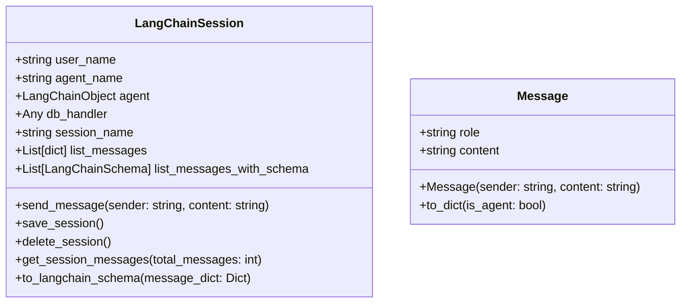

[](https://recall.space/)

[](https://www.python.org/)
[](https://github.com/psf/black)

| Environment | Version |
| ----------- | ------- |
| Production  | 0.0.4   |
| Development | 0.0.4   |


# 🧠Recall Space Benchmark

+ The **Recall Space Benchmark** is carefully designed to test the ability of LLM based application to retain state "remember" from past interactions.
+ These benchmarks are inspired by the Good AI Benchmarks, which can be found at 🎊 [GoodAI GitHub](https://github.com/GoodAI/goodai-ltm-benchmark). Big thanks for their efforts.

# 💬LangChainSession

+ Use the `LangChainSession` as a wrapper around any LangChain object that implements the `invoke` method. LangChainSession is a class that stores the state of the conversation.



## LangChainSession with Azure Open AI (No backend).

+ It's beneficial to experiment with a stateful chat with a Langchain object.
+ The state is not persisted in this configuration.

```python
from recall_space_benchmarks.session.langchain_session import LangChainSession
from langchain_openai import AzureChatOpenAI
import os

user_name = "Developer G"
llm = AzureChatOpenAI(
        base_url=os.getenv("AZURE_GPT4O_BASE_URL"),
        api_key=os.getenv("AZURE_GPT4O_KEY"),
        api_version=os.getenv("AZURE_GPT4O_API_VERSION"),
        streaming=False,
    )
llm_name = "gpt-4o"

session = LangChainSession(
    user_name=user_name, 
    agent_name=llm_name,
    agent=llm,
    db_handler=None,
    session_name="Test of Developer and Azure Open AI gpt-4o")

# The langchain object should reply -> Hello, how may I help you.
session.send_message(sender=user_name, content="hi again!")
session.send_message(sender=user_name, content="What is the capital of Germany?")
```

## LangChainSession with TestSuite.

+ Run the **colors** benchmark on Agents or LLMs from Langchain.
+ Currently, the only other benchmark available is **jokes**. We will add more benchmarks gradually.

```python
import os
from recall_space_benchmarks.test_suite import TestSuite
from recall_space_benchmarks.utils.mongo_connector import MongoConnector
from recall_space_benchmarks.session.langchain_session import LangChainSession
from recall_space_benchmarks.test_suite.tests import Colors
from langchain_openai import AzureChatOpenAI

# Setup LLM or Agent with LangChain.
llm_name = "gpt-4o"
tested_llm = AzureChatOpenAI(
        base_url=os.getenv("AZURE_GPT4O_BASE_URL"),
        api_key=os.getenv("AZURE_GPT4O_KEY"),
        api_version=os.getenv("AZURE_GPT4O_API_VERSION"),
        streaming=False,
    )

# Setup Mongo Backend (Optional)
mongo_connector = MongoConnector(
    db_name=os.getenv("MONGO_DB_NAME"),
    collection_name=os.getenv("MONGO_COLLECTION"),
    uri=os.getenv("MONGO_DB_CONNECTION_STRING"))

# Create Langchain Session.
user_name = "Developer G"
session = LangChainSession(
    agent_name=llm_name,
    agent=tested_llm,
    user_name=user_name, 
    db_handler=mongo_connector,
    session_name=f"Assesment Colors")

# Configure the test.
# Provide a set of facts to the agent, with varying validity 
# over the course of the conversation.
# Make 4 knowledge checks to see if the agent remembers.
colors = Colors(total_questions=6,total_assessments=4)

# Another LLM to check the results of the tests.
llm_judge = AzureChatOpenAI(
        base_url=os.getenv("AZURE_GPT4O_MINI_BASE_URL"),
        api_key=os.getenv("AZURE_GPT4O_MINI_KEY"),
        api_version=os.getenv("AZURE_GPT4O_MINI_API_VERSION"),
        streaming=False,
    )

# Configure the test object.
test_suite = TestSuite(
    session=session, 
    tests=[colors],
    include_chat_history=False,
    llm_judge=llm_judge)

# Run the test.
# NOTE: During the conversation setup, the chat history is passed under 
# the key "chat_history".
# During assessment, the parameter include_chat_history controls whether 
# the chat history is passed.
test_suite.run_test("Colors")
```
