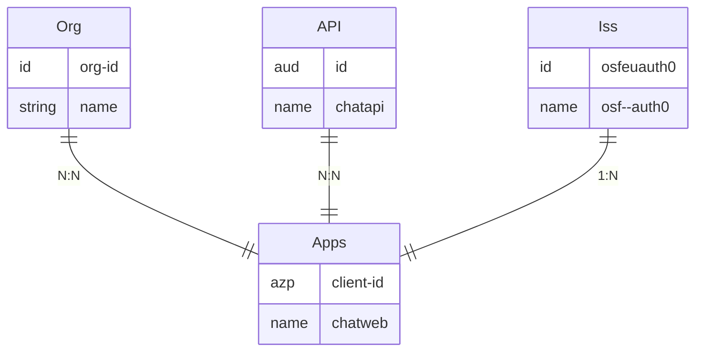

# Auth0

Entity relationship diagram for Auth0

## Entities

- Org N:N Apps
- API N:N Apps
- Iss 1:N Apps

## Options

1. 1 app/client-id/azp per SPA
   1. might allow more flexibility in Auth0 configs
2. 1 API/aud per SPA
   1. Cleaner setup.
